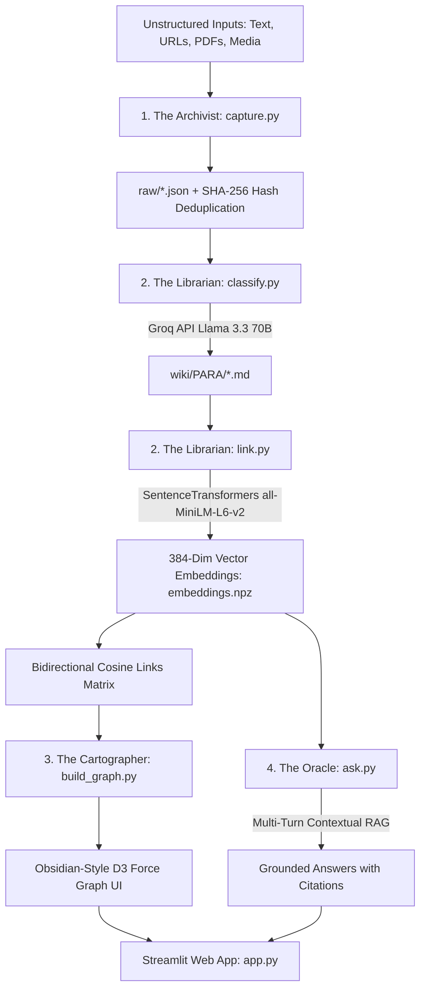

# 🧠 Second Brain — Self-Organizing Knowledge Management System

<div align="center">

[](https://www.python.org/)
[](https://groq.com/)
[](https://www.sbert.net/)
[](https://pytest.org/)
[](https://streamlit.io/)
[](https://opensource.org/licenses/MIT)

**An autonomous personal knowledge operating system that captures unstructured ideas, auto-classifies them using the PARA framework via Groq LLM, calculates 384-dimensional semantic embeddings, renders an Obsidian-grade force-directed neural graph, and answers natural language queries via Multi-Turn RAG.**

[Live Demo](http://localhost:8501) • [System Architecture](#-system-architecture) • [Quickstart](#-quickstart--setup) • [Features](#-key-features) • [Test Suite](#-testing)

</div>

---

## 🎬 Demo & Visual Previews

### 📺 Video Walkthrough & Interactive Demo
> 💡 **Live Web App**: Launch the interactive Streamlit application locally with `streamlit run app.py` or deploy directly to Streamlit Cloud.

```
┌──────────────────────────────────────────────────────────────────────────────────────────┐
│                                 SECOND BRAIN WORKSPACE                                   │
│  [📚 37 Notes Indexed]  [🔗 48 Semantic Links]  [⚡ Llama 3.3 70B]  [🎯 384-Dim Vectors] │
├──────────────────────────────────────────────────────────────────────────────────────────┤
│ ┌──────────────────────┬──────────────────────┬────────────────────┬───────────────────┐ │
│ │ 🕸️ Interactive Graph │ 💬 Ask Second Brain  │ 📚 Knowledge Hub   │ 📊 Brain Metrics  │ │
│ └──────────────────────┴──────────────────────┴────────────────────┴───────────────────┘ │
│                                                                                          │
│   • Neural Graph : Real-time D3.js force physics, cluster galaxies & sliding note drawer │
│   • RAG Synapse  : Grounded multi-turn conversational Q&A with confidence citations      │
│   • Library Hub  : Semantic vector search + live PARA filtering & tag classification    │
│   • Analytics    : PARA category health, graph connectivity & knowledge growth timeline │
└──────────────────────────────────────────────────────────────────────────────────────────┘
```

---

## 🌟 System Architecture

The engine functions as a 4-phase autonomous pipeline:



### Core Architecture Modules:
1. **The Archivist (`capture.py`)**: Ingests raw text, web URLs (cleaned with BeautifulSoup), PDFs (parsed with PyPDF), and media assets with UUIDs, UTC timestamps, and SHA-256 duplicate rejection.
2. **The Librarian (`classify.py` & `link.py`)**:
   - `classify.py`: Classifies content into PARA categories (*Projects*, *Areas*, *Resources*, *Archives*) with title and semantic tags.
   - `link.py`: Encodes 384-dimensional vectors with `sentence-transformers` (`all-MiniLM-L6-v2`) and dynamically links semantically related notes ($\text{sim} \ge 0.45$).
3. **The Cartographer (`build_graph.py` & `static/graph.html`)**: Renders an **Obsidian-style D3.js force-directed physics graph** with dynamic node sizing, spring tension, focus dimming, and an interactive slide-over paper note inspector.
4. **The Oracle (`ask.py` & `app.py`)**:
   - `ask.py`: Multi-turn conversational RAG engine that resolves follow-up queries, retrieves top-$K$ semantic notes, and synthesizes cited answers via Groq LLM.
   - `app.py`: Warm Editorial Paper dashboard integrating real-time analytics, interactive graph iframe, and live capture.

---

## 🎨 Warm Editorial Paper Design System

Crafted with a bespoke **Monocle Press / Literary Notebook** aesthetic:

| PARA Category | Palette Ink | Role & Domain |
|---|---|---|
| **🔴 Projects** | Terracotta (`#C2410C`) | Active, time-bound goals and deliverables |
| **🟣 Areas** | Deep Plum (`#7C3AED`) | Ongoing responsibilities and standards |
| **🔵 Resources** | Oxford Indigo (`#1D4ED8`) | Reference material, libraries, and guides |
| **🟢 Archives** | Olive Moss (`#4D7C0F`) | Inactive, historical, or completed notes |

- **Typography**: `Newsreader` (Editorial Serif) + `Plus Jakarta Sans` (High-clarity UI) + `IBM Plex Mono` (Data/Code).
- **Canvas**: Warm Cream Parchment (`#FAF8F5`) with crisp paper elevation and 1px editorial borders.

---

## 🚀 Quickstart & Setup

### 1. Prerequisites
- Python 3.10 or higher
- A free Groq API key from [console.groq.com](https://console.groq.com)

### 2. Environment Setup
```bash
git clone https://github.com/your-username/second-brain.git
cd second-brain

# Create virtual environment
python -m venv .venv

# Activate virtual environment
# Windows PowerShell:
.venv\Scripts\Activate.ps1
# macOS/Linux:
source .venv/bin/activate

# Install dependencies
pip install -r requirements.txt
```

### 3. Configure API Key
Create a `.env` file in the root directory:
```env
GROQ_API_KEY=your_groq_api_key_here
```

### 4. Launch the Web Application
```bash
streamlit run app.py
```
> Open [http://localhost:8501](http://localhost:8501) in your browser.

---

## 💻 CLI Pipeline Commands

```powershell
# 1. Capture text or URL
python capture.py -t note -c "FastAPI is a modern Python web framework for async APIs."
python capture.py -t link -c "https://docs.pytest.org/"

# 2. Run PARA Classification
python classify.py

# 3. Compute Embeddings & Auto-Link
python link.py

# 4. Rebuild Knowledge Graph
python build_graph.py

# 5. Query Second Brain (RAG)
python ask.py "What notes do I have about Python frameworks?"

# 6. Database Health Summary
python summary.py
```

---

## 🧪 Testing

The repository includes a comprehensive 37-test suite covering all modules:

```powershell
pytest tests/ -v
```

```
============================== test session starts ==============================
collected 37 items

tests/test_analytics.py ......... PASSED [ 24%]
tests/test_ask.py ............... PASSED [ 43%]
tests/test_build_graph.py ....... PASSED [ 51%]
tests/test_capture.py ........... PASSED [ 70%]
tests/test_classify.py .......... PASSED [ 78%]
tests/test_config.py ............ PASSED [ 83%]
tests/test_export_import.py ..... PASSED [ 89%]
tests/test_link.py .............. PASSED [ 94%]
tests/test_llm_client.py ........ PASSED [ 97%]
tests/test_manage_notes.py ...... PASSED [100%]

======================= 37 passed in 100% =======================
```

---

## ☁️ Deployment to Streamlit Cloud

1. Push your repository to GitHub:
   ```bash
   git push origin main
   ```
2. Go to [share.streamlit.io](https://share.streamlit.io) and create a **New App**.
3. Point to your repository and set Main file path to `app.py`.
4. In **Settings → Secrets**, add:
   ```toml
   GROQ_API_KEY = "your_groq_api_key_here"
   ```
5. Click **Deploy!**

---

## 📁 Repository Structure

```
Second Brain/
├── raw/                       # Captured JSON objects with UUID + timestamps
├── wiki/                      # Categorized Markdown notes with YAML frontmatter
│   ├── Projects/
│   ├── Areas/
│   ├── Resources/
│   └── Archives/
├── static/                    # Frontend assets & UI engines
│   ├── graph.html             # D3.js Obsidian-grade force physics graph engine
│   ├── graph_data.js          # Exported graph dataset
│   ├── style.css              # Warm Editorial Paper design tokens & styles
│   └── stitch_ui.html         # Standalone full-featured web showcase
├── tests/                     # Pytest suite (37 unit & integration tests)
│   ├── test_analytics.py
│   ├── test_ask.py
│   ├── test_build_graph.py
│   ├── test_capture.py
│   ├── test_classify.py
│   ├── test_config.py
│   ├── test_export_import.py
│   ├── test_link.py
│   ├── test_llm_client.py
│   ├── test_manage_notes.py
│   └── test_utils.py
├── .streamlit/                # Streamlit configuration & theme
│   └── config.toml
├── config.py                  # Single source of truth for paths & constants
├── utils.py                   # File I/O, frontmatter parser, SHA-256 hashing
├── capture.py                 # Ingestion pipeline & CLI
├── llm_client.py              # Groq API wrapper with multi-model fallback
├── classify.py                # LLM PARA categorization with heuristic safety
├── link.py                    # SentenceTransformers embedding & auto-linking
├── build_graph.py             # Graph data exporter
├── ask.py                     # RAG retrieval & Q&A pipeline with memory
├── manage_notes.py            # Note lifecycle, backlinks & cascade deletion
├── export_import.py           # Multi-modal file ingestion & backup generation
├── analytics.py               # Deep knowledge base metrics & growth analytics
├── summary.py                 # Terminal database summary report
├── app.py                     # Full Streamlit Web App Dashboard
├── requirements.txt           # Pinned dependencies
└── README.md                  # System documentation
```

---

## 📜 License
Distributed under the [MIT License](LICENSE).
