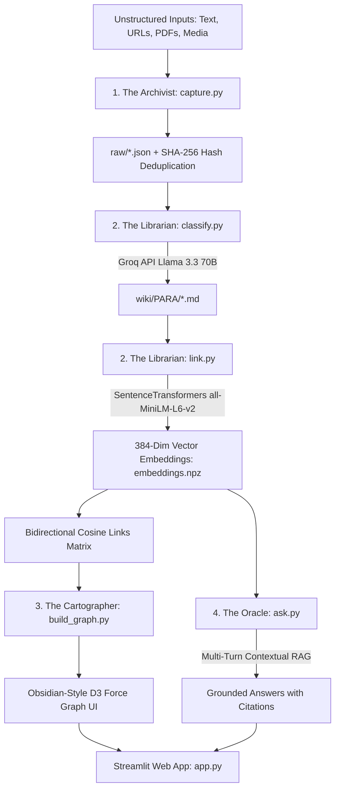
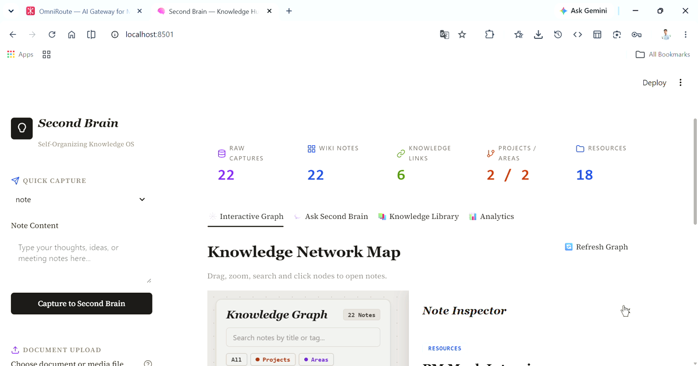
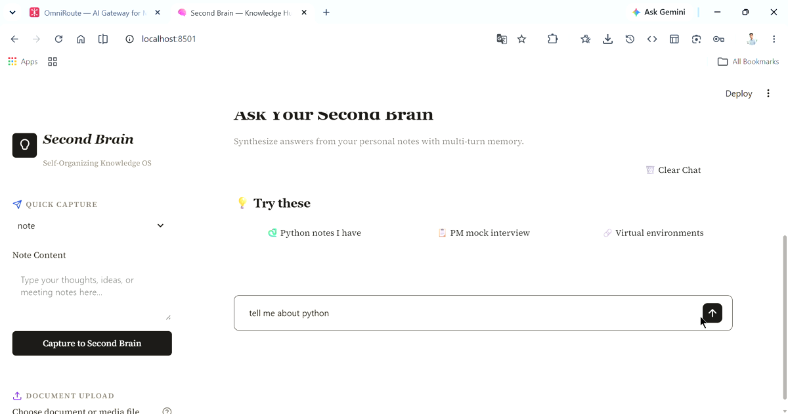
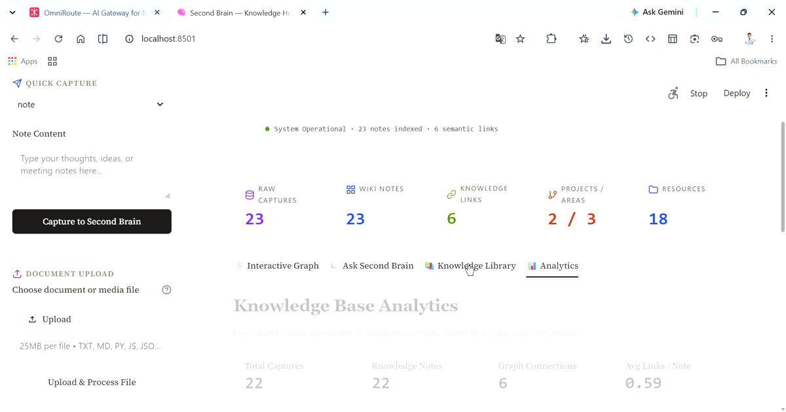

<div align="center">

# 🧠 Second Brain — Self-Organizing Knowledge Management System

[](https://www.python.org/)
[](https://groq.com/)
[](https://www.sbert.net/)
[](https://pytest.org/)
[](#-reliability--fallback-design)
[](https://opensource.org/licenses/MIT)

**An autonomous personal knowledge system: capture anything, let AI classify and auto-link it, watch it render as a live explorable graph, then ask it questions in plain English and get answers synthesized — with citations — from your own notes.**

</div>

---

## TL;DR

Every notes app fails the same way: information goes in and nothing useful comes back out. This is the opposite bet — a **4-stage autonomous pipeline** (capture → classify → link → graph, plus a RAG query layer) that turns unstructured input into a self-organizing, queryable knowledge base, with no manual filing required. What makes it more than a class project: a genuine **3-model LLM fallback chain**, a **full heuristic classifier** that keeps the pipeline running even if every LLM call fails, and a **hybrid retrieval scorer** that fixes a real, common RAG failure mode (pure embedding similarity missing obvious keyword/title matches).

**My role:** sole builder — architecture, all prompt design, the reliability/fallback layers, and the 37-test suite, end to end.

---

## 📖 Table of Contents

- [The Problem](#-the-problem)
- [System Architecture](#-system-architecture)
- [Demo](#-demo)
- [Reliability & Fallback Design](#-reliability--fallback-design)
- [Prompt Design](#️-prompt-design)
- [The Retrieval Design — Beyond Pure Embedding Search](#-the-retrieval-design--beyond-pure-embedding-search)
- [Design System](#-warm-editorial-paper-design-system)
- [Quickstart & Setup](#-quickstart--setup)
- [CLI Pipeline Commands](#-cli-pipeline-commands)
- [Testing](#-testing)
- [Deployment](#️-deployment-to-streamlit-cloud)
- [Repository Structure](#-repository-structure)
- [What This Demonstrates](#-what-this-demonstrates)

---

## 🔍 The Problem

Every notes app fails the same way: you capture hundreds of notes, bookmarks, PDFs, and ideas — and then you never find them again. Information goes in, but nothing comes back out. Notes sit in folders nobody re-reads. Bookmarks pile up unread. Knowledge doesn't compound.

**The goal:** an end-to-end system where you can capture anything, have AI classify and file it automatically (PARA method), auto-link it to related knowledge via embeddings, visualize it as a live explorable graph, and query it in plain English — answers synthesized from your own accumulated notes, not the open internet.

> Not a notes app. Not a chatbot. A brain that organizes itself and answers for you.

---

## 🌟 System Architecture

The engine functions as a 4-phase autonomous pipeline:



### Core Architecture Modules

1. **The Archivist (`capture.py`)** — Ingests raw text, web URLs (cleaned with BeautifulSoup), PDFs (parsed with PyPDF), and media assets with UUIDs, UTC timestamps, and SHA-256 duplicate rejection.
2. **The Librarian (`classify.py` & `link.py`)**:
   - `classify.py` — Classifies content into PARA categories (*Projects*, *Areas*, *Resources*, *Archives*) with title and semantic tags.
   - `link.py` — Encodes 384-dimensional vectors with `sentence-transformers` (`all-MiniLM-L6-v2`) and dynamically links semantically related notes (similarity ≥ 0.45, configurable).
3. **The Cartographer (`build_graph.py` & `static/graph.html`)** — Renders an **Obsidian-style D3.js force-directed physics graph** with dynamic node sizing, spring tension, focus dimming, and an interactive slide-over note inspector.
4. **The Oracle (`ask.py` & `app.py`)**:
   - `ask.py` — Multi-turn conversational RAG engine that resolves follow-up queries, retrieves top-K semantic notes, and synthesizes cited answers via Groq LLM.
   - `app.py` — Warm Editorial Paper dashboard integrating real-time analytics, interactive graph iframe, and live capture.

---

## 🎬 Demo

A full walkthrough of the live app — capture, the interactive knowledge graph, Ask Your Second Brain, file/document upload, and wiki backup/export:

<p align="center">

</p>

<p align="center"><sub><a href="assets/second-brain-demo-full.mp4">▶️ Full-length version (second-brain-demo-full.mp4)</a></sub></p>

**Dashboard & Knowledge Graph** — live stats bar (raw captures, wiki notes, semantic links, PARA breakdown) plus the interactive force-directed graph:



**Ask Your Second Brain** — the RAG query interface, multi-turn memory, grounded answers only:



**Analytics** — knowledge base growth metrics, graph connectivity, PARA category health:



---

## 🛡 Reliability & Fallback Design

AI-dependent pipelines fail in production for boring reasons — rate limits, a model returning malformed JSON, an API being briefly unreachable. This system is designed so none of those take the whole pipeline down.

**Three-model fallback chain**, tried in order on failure, with jittered exponential backoff specifically for rate-limit (429) errors:

```python
FALLBACK_MODELS = [GROQ_MODEL, "llama-3.1-8b-instant", "gemma2-9b-it"]
# GROQ_MODEL = "llama-3.3-70b-versatile"
```

**Two-layer JSON recovery** before giving up on a response: strip markdown code fences first, then regex-extract the first `{...}` block if direct parsing still fails — because LLMs asked for JSON reliably wrap it in ```` ```json ```` blocks or add a stray sentence around it.

**A complete non-AI fallback classifier** — not just a default value. If every model in the fallback chain fails, `classify.py` doesn't stop the pipeline; it runs a full keyword-heuristic classifier that still assigns a real PARA category (matching on words like "deadline"/"sprint" → *Projects*, "routine"/"habit" → *Areas*, "archive"/"deprecated" → *Archives*, defaulting to *Resources*) and extracts tags from the content directly. The note still gets filed, searchable, and linkable — just without AI-assisted nuance.

**A confidence-gated refusal in the RAG layer** — `ask()` checks the top retrieved note's similarity score before ever calling the LLM. Below `0.1`, it returns *"I don't have any relevant notes in your Second Brain to answer this question"* directly, without spending an API call on a question it already knows it can't ground.

---

## ✍️ Prompt Design

**Classification prompt (`classify.py`)** — deliberately narrow: one task, one fixed schema, temperature low enough to keep categorization consistent across runs.

```text
You are a knowledge classifier. Categorize the note using the PARA method:
- Projects: active, time-bound goals
- Areas: ongoing responsibilities
- Resources: reference material and interests
- Archives: completed or inactive items

Respond ONLY in valid JSON with this exact structure:
{
  "category": "one of: Projects, Areas, Resources, Archives",
  "title": "concise descriptive note title, max 80 characters",
  "tags": ["3 to 5 relevant keywords"],
  "summary": "one-line summary, max 120 characters"
}
```

**RAG synthesis prompt (`ask.py`)** — the interesting part isn't the instruction to answer questions, it's the explicit instruction *not* to:

```text
You are Second Brain, an AI assistant that answers questions based on
the user's personal notes and conversation history.
Synthesize a concise, clear answer using ONLY the provided context
notes and prior conversation turns below.
Do not invent information outside the provided notes.
If the notes do not contain enough information to answer the question,
state that clearly.
When answering follow-up questions (e.g. "tell me more about that",
"explain simply", "what else?"), refer to the prior conversation
history and notes.

Respond ONLY in valid JSON with this exact structure:
{
  "answer": "your clear synthesized response based on the context notes and conversation history",
  "citations": ["id_of_note1", "id_of_note2"]
}
```

**Why it's built this way:**

| Choice | Reasoning |
|---|---|
| `"Do not invent information outside the provided notes"` | The single most important line in the whole system — a personal knowledge assistant that hallucinates plausible-sounding facts is worse than useless, because the entire premise is that answers come from *your* notes, not general knowledge |
| Explicit citations field in the schema | Forces the model to name which notes it drew from, which the app then validates against the real retrieved set (see below) rather than trusting the citation blindly |
| Follow-up handling named explicitly in-prompt | "Tell me more about that" is meaningless without conversation history — naming the pattern in the prompt, not just passing history silently, measurably improved short follow-up handling during testing |
| Low temperature, schema-locked JSON everywhere | Both prompts are extraction/classification tasks wearing a chat interface, not creative writing — consistency across runs matters more than variety |

---

## 🔎 The Retrieval Design — Beyond Pure Embedding Search

A common, easy-to-miss RAG failure mode: pure cosine-similarity search over embeddings can under-rank a note that obviously matches on exact keywords, because semantic similarity and lexical overlap aren't the same signal. `ask.py` retrieves with a **hybrid score** instead of raw similarity alone:

```python
hybrid_score = (embedding_similarity * 0.35) + (title_match_ratio * 0.50) + (body_match_ratio * 0.15)
```

Title match is weighted highest deliberately — if a question shares words with a note's *title*, that's usually the strongest real signal of relevance, stronger than embedding similarity alone tends to capture. This is a small design decision that only shows up when you actually query the system with real, imprecise, human-phrased questions rather than test data.

**Citations are verified, not trusted.** After the LLM returns `citations: [...]`, the app matches each one back against the actual retrieved note set (by ID, ID prefix, or title substring) before displaying a source — so a citation the model got slightly wrong (wrong ID format, paraphrased title) still resolves to a real note instead of silently failing or worse, a fabricated one slipping through unchecked.

---

## 🎨 Warm Editorial Paper Design System

Crafted with a bespoke **Monocle Press / Literary Notebook** aesthetic:

| PARA Category | Palette Ink | Role & Domain |
|---|---|---|
| **🔴 Projects** | Terracotta (`#C2410C`) | Active, time-bound goals and deliverables |
| **🟣 Areas** | Deep Plum (`#7C3AED`) | Ongoing responsibilities and standards |
| **🔵 Resources** | Oxford Indigo (`#1D4ED8`) | Reference material, libraries, and guides |
| **🟢 Archives** | Olive Moss (`#4D7C0F`) | Inactive, historical, or completed notes |

- **Typography:** `Newsreader` (Editorial Serif) + `Plus Jakarta Sans` (High-clarity UI) + `IBM Plex Mono` (Data/Code)
- **Canvas:** Warm Cream Parchment (`#FAF8F5`) with crisp paper elevation and 1px editorial borders

---

## 🚀 Quickstart & Setup

### 1. Prerequisites
- Python 3.10 or higher
- A free Groq API key from [console.groq.com](https://console.groq.com)

### 2. Environment Setup
```bash
git clone https://github.com/Rehansheikh787/Second-Brain-Self-Organizing-Knowledge-Management-System.git
cd Second-Brain-Self-Organizing-Knowledge-Management-System

python -m venv .venv
# Windows: .venv\Scripts\Activate.ps1
# macOS/Linux: source .venv/bin/activate

pip install -r requirements.txt
```

### 3. Configure API Key
Create a `.env` file in the root directory:
```env
GROQ_API_KEY=your_groq_api_key_here
```

### 4. Launch the Web Application
```bash
streamlit run app.py
```
> Open [http://localhost:8501](http://localhost:8501) in your browser.

---

## 💻 CLI Pipeline Commands

```bash
# 1. Capture text or URL
python capture.py -t note -c "FastAPI is a modern Python web framework for async APIs."
python capture.py -t link -c "https://docs.pytest.org/"

# 2. Run PARA Classification
python classify.py

# 3. Compute Embeddings & Auto-Link
python link.py

# 4. Rebuild Knowledge Graph
python build_graph.py

# 5. Query Second Brain (RAG)
python ask.py "What notes do I have about Python frameworks?"

# 6. Database Health Summary
python summary.py
```

---

## 🧪 Testing

A 37-test suite covering every module:

```bash
pytest tests/ -v
```

```
tests/test_analytics.py ......... PASSED
tests/test_ask.py ............... PASSED
tests/test_build_graph.py ....... PASSED
tests/test_capture.py ........... PASSED
tests/test_classify.py .......... PASSED
tests/test_config.py ............ PASSED
tests/test_export_import.py ..... PASSED
tests/test_link.py .............. PASSED
tests/test_llm_client.py ........ PASSED
tests/test_manage_notes.py ...... PASSED
======================= 37 passed =======================
```

---

## ☁️ Deployment to Streamlit Cloud

1. Push your repository to GitHub
2. Go to [share.streamlit.io](https://share.streamlit.io) and create a **New App**
3. Point to your repository, set the main file path to `app.py`
4. In **Settings → Secrets**, add:
   ```toml
   GROQ_API_KEY = "your_groq_api_key_here"
   ```
5. Click **Deploy**

---

## 📁 Repository Structure

```
Second-Brain/
├── raw/                        Captured JSON objects with UUID + timestamps
├── wiki/                       Categorized Markdown notes with YAML frontmatter
│   ├── Projects/  ├── Areas/  ├── Resources/  └── Archives/
├── static/                     Frontend assets & UI engines
│   ├── graph.html              D3.js Obsidian-grade force physics graph engine
│   ├── graph_data.js           Exported graph dataset
│   ├── style.css               Warm Editorial Paper design tokens
│   └── stitch_ui.html          Standalone full-featured web showcase
├── tests/                      Pytest suite (37 unit & integration tests)
├── config.py                   Single source of truth for paths & constants
├── utils.py                    File I/O, frontmatter parser, SHA-256 hashing
├── capture.py                  Ingestion pipeline & CLI
├── llm_client.py                Groq API wrapper with multi-model fallback
├── classify.py                  LLM PARA categorization with heuristic safety net
├── link.py                      SentenceTransformers embedding & auto-linking
├── build_graph.py               Graph data exporter
├── ask.py                       RAG retrieval & Q&A pipeline with memory
├── manage_notes.py              Note lifecycle, backlinks & cascade deletion
├── export_import.py             Multi-modal file ingestion & backup generation
├── analytics.py                 Deep knowledge base metrics & growth analytics
├── app.py                       Full Streamlit Web App Dashboard
└── requirements.txt              Pinned dependencies
```

---

## 🎓 What This Demonstrates

- **Designing for AI failure at every layer, not just the happy path** — a 3-model fallback chain, two-layer JSON recovery, a complete non-AI classifier fallback, and a confidence-gated refusal that avoids an unnecessary API call entirely
- **Recognizing a subtle retrieval failure mode and fixing it deliberately** — the hybrid title/body/embedding scorer exists because pure semantic search missed obvious keyword matches during real testing, not as a default choice
- **Verifying model output instead of trusting it** — citations are checked against the actual retrieved note set before being shown as a source, closing the gap between "the model said it cited this" and "it actually did"
- **Prompt constraints written from observed failure, not just best practice** — the explicit "do not invent information" instruction and the named follow-up-handling pattern both trace back to specific behavior the system needed to prevent
- **Shipping a complete, tested system** — 37 passing tests across every module, not just a demo script that works once

---

<div align="center">

I'm a **Chemical Engineer transitioning into AI Product Management**, and I build complete, tested AI-native systems like this one — including the reliability layers that are easy to skip — to learn product thinking by doing.

📂 More case studies and projects on my [GitHub profile](https://github.com/Rehansheikh787).

</div>
