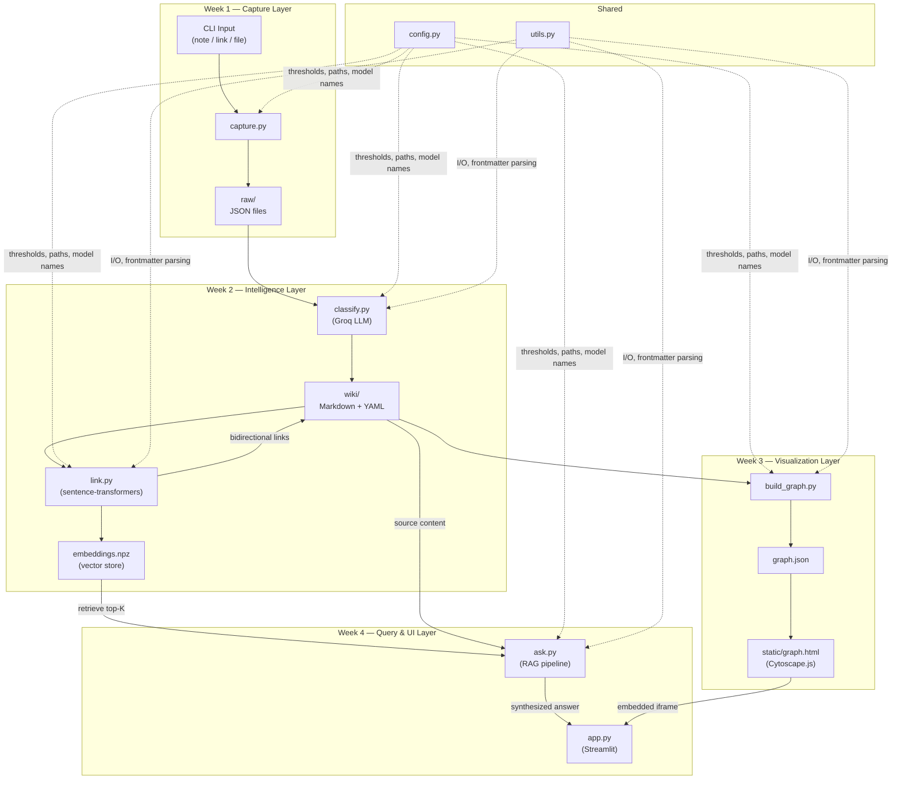
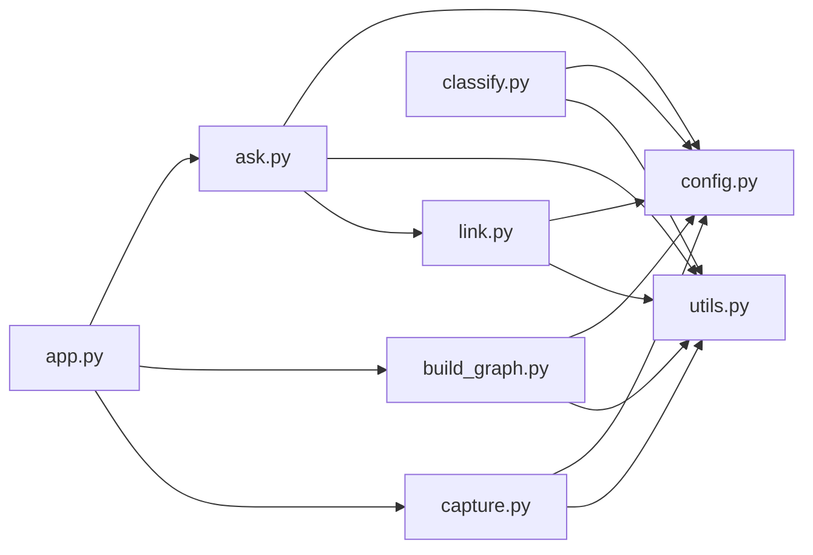
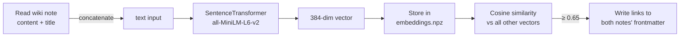
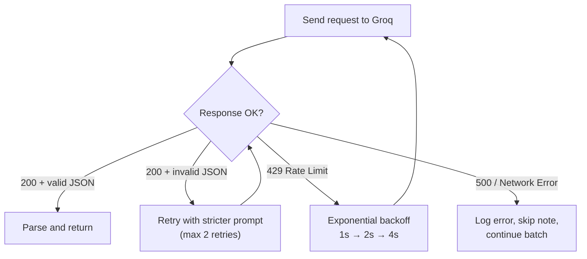

# Second Brain — Detailed Architecture

## 1. System Overview

Second Brain is a **personal knowledge management system** that captures notes, auto-classifies them using AI, links related content via embeddings, visualizes connections as an interactive graph, and answers natural-language questions via RAG — all deployed as a single Streamlit app.

**Constraints:**
- Single user, local-first (deployed read-only)
- No database — filesystem only (Markdown + JSON)
- Free-tier AI services only (Groq API, local embeddings)
- 4-week incremental build — each week's output feeds the next

---

## 2. System Architecture Diagram



---

## 3. Data Architecture

### 3.1 Raw Capture Schema (`raw/<uuid>.json`)

Every capture lands as a single JSON file. This is the **immutable source of truth** — never modified after creation.

```json
{
  "id": "a1b2c3d4-...",
  "created": "2026-07-08T13:00:00+05:30",
  "source_type": "note",
  "content": "The actual text content or URL or file path",
  "metadata": {
    "original_filename": null,
    "char_count": 342,
    "content_hash": "sha256:abcdef..."
  }
}
```

| Field | Type | Purpose |
|-------|------|---------|
| `id` | UUID v4 string | Globally unique identifier |
| `created` | ISO 8601 datetime | When captured (with timezone) |
| `source_type` | `"note"` \| `"link"` \| `"file"` | Input classification |
| `content` | string | The raw payload |
| `metadata.content_hash` | SHA-256 string | Duplicate detection key |

> **Design decision:** JSON (not Markdown) for raw captures because raw content is unstructured and may contain YAML-breaking characters. Markdown + YAML frontmatter is reserved for the curated `wiki/` layer.

---

### 3.2 Wiki Note Schema (`wiki/<uuid>.md`)

Classified, linked, structured notes. This is the **active knowledge base**.

```yaml
---
id: "a1b2c3d4-..."
title: "Python asyncio patterns for web scraping"
category: "Resources"
tags: ["python", "asyncio", "web-scraping"]
created: "2026-07-08T13:00:00+05:30"
source_type: "note"
links:
  - id: "e5f6g7h8-..."
    similarity: 0.78
  - id: "i9j0k1l2-..."
    similarity: 0.71
embedding_version: "all-MiniLM-L6-v2"
---

The actual note content goes here, unmodified from the original capture.
```

| Frontmatter Field | Type | Source |
|-------------------|------|--------|
| `id` | string | Carried from raw capture |
| `title` | string (≤120 chars) | Generated by LLM |
| `category` | `"Projects"` \| `"Areas"` \| `"Resources"` \| `"Archives"` | Generated by LLM |
| `tags` | list of 3–5 strings | Generated by LLM |
| `links` | list of `{id, similarity}` | Computed by `link.py` |
| `embedding_version` | string | Model name used — for cache invalidation |

---

### 3.3 Embedding Store (`embeddings.npz`)

A single NumPy compressed file holding all embedding vectors, keyed by note ID.

```python
# Structure:
{
    "ids": np.array(["uuid-1", "uuid-2", ...]),        # shape: (N,)
    "vectors": np.array([[0.12, -0.34, ...], ...]),     # shape: (N, 384)
    "model": "all-MiniLM-L6-v2"                        # metadata
}
```

> **Why `.npz` over a vector DB?** For < 1,000 notes, NumPy cosine similarity on a (N, 384) matrix takes < 10ms. A vector DB (Chroma, FAISS) adds dependency weight with no measurable benefit at this scale. We store the model name to know when embeddings need recomputation.

---

### 3.4 Graph Export Schema (`graph.json`)

```json
{
  "metadata": {
    "generated_at": "2026-07-08T13:00:00+05:30",
    "node_count": 42,
    "edge_count": 87
  },
  "nodes": [
    {
      "id": "uuid-1",
      "label": "Python asyncio patterns",
      "category": "Resources",
      "summary": "Notes on async/await patterns for web scraping",
      "tags": ["python", "asyncio"],
      "link_count": 3
    }
  ],
  "edges": [
    {
      "source": "uuid-1",
      "target": "uuid-2",
      "weight": 0.82
    }
  ]
}
```

---

## 4. Module Architecture

### 4.1 Module Dependency Graph



---

### 4.2 Per-Module Breakdown

#### `config.py` — Shared Configuration

**Responsibility:** Single source of truth for all tunables — paths, thresholds, model names, API keys.

```python
# Key exports:
RAW_DIR: Path           # "./raw"
WIKI_DIR: Path          # "./wiki"
STATIC_DIR: Path        # "./static"
GRAPH_JSON: Path        # "./graph.json"
EMBEDDINGS_FILE: Path   # "./embeddings.npz"

GROQ_API_KEY: str       # from env var GROQ_API_KEY
GROQ_MODEL: str         # "llama-3.1-70b-versatile"

EMBEDDING_MODEL: str    # "all-MiniLM-L6-v2"
SIMILARITY_THRESHOLD: float  # 0.65
TOP_K_RETRIEVAL: int    # 5

PARA_CATEGORIES: list   # ["Projects", "Areas", "Resources", "Archives"]
```

> **Design decision:** No `.yaml` or `.toml` config file. A Python module is simpler, type-checkable, and directly importable. Environment variables for secrets only.

---

#### `utils.py` — Shared Utilities

**Responsibility:** File I/O, YAML frontmatter parsing/writing, content hashing. Used by every other module.

```python
# Key functions:
def read_frontmatter(filepath: Path) -> tuple[dict, str]
    """Parse YAML frontmatter + body from a Markdown file."""

def write_frontmatter(filepath: Path, metadata: dict, body: str) -> None
    """Write YAML frontmatter + body to a Markdown file."""

def compute_content_hash(content: str) -> str
    """SHA-256 hash for duplicate detection."""

def list_wiki_notes() -> list[Path]
    """Return all .md files in wiki/ directory."""

def list_raw_captures() -> list[Path]
    """Return all .json files in raw/ directory."""

def load_json(filepath: Path) -> dict
    """Read and parse a JSON file."""

def save_json(filepath: Path, data: dict) -> None
    """Write data as formatted JSON."""
```

---

#### `capture.py` — Capture Pipeline (Week 1)

**Responsibility:** Accept input (note text, URL, or file path), validate it, create a raw capture JSON file.

```
Input: CLI args (--type, --content) or interactive prompt
Output: raw/<uuid>.json
Side effects: None (pure write to raw/)
```

```python
# Public API:
def capture(content: str, source_type: str) -> str
    """
    Validate input, generate UUID + timestamp, compute content hash,
    check for duplicates, write to raw/<uuid>.json.
    Returns: the UUID of the created capture.
    Raises: ValueError for empty content, DuplicateError for hash collision.
    """

# CLI entry point:
if __name__ == "__main__":
    # argparse: capture.py --type note --content "My idea..."
    # argparse: capture.py --type link --content "https://..."
    # argparse: capture.py --type file --content "./path/to/file.pdf"
```

**Internal logic:**
1. Validate `source_type` is one of `["note", "link", "file"]`
2. Validate `content` is non-empty
3. If `source_type == "file"`, read file contents (handle encoding errors)
4. Compute `content_hash` → scan existing `raw/` for hash collision → warn if duplicate
5. Generate UUID v4 + ISO 8601 timestamp
6. Write `raw/<uuid>.json`

---

#### `classify.py` — PARA Classification (Week 2.1)

**Responsibility:** Send raw content to Groq LLM, parse structured response, write classified note to `wiki/`.

```
Input: raw/<uuid>.json
Output: wiki/<uuid>.md (with YAML frontmatter)
Dependencies: Groq API (network), config.py, utils.py
```

```python
# Public API:
def classify_note(raw_path: Path) -> Path
    """
    Read raw capture, send to LLM for classification,
    parse response into {category, tags, summary},
    write structured Markdown to wiki/<uuid>.md.
    Returns: Path to the created wiki note.
    """

def classify_all_pending() -> list[Path]
    """
    Find all raw captures without a corresponding wiki note,
    classify each one. Returns list of created wiki paths.
    """
```

**LLM Prompt Strategy:**

```
System: You are a knowledge classifier. Categorize the following note using 
the PARA method. Respond ONLY in valid JSON.

User: <note content>

Expected response:
{
  "category": "Resources",
  "tags": ["python", "web-scraping", "tutorial"],
  "summary": "Python web scraping tutorial using BeautifulSoup"
}
```

**Error handling:**
1. LLM returns non-JSON → retry up to 2 times with stricter prompt
2. LLM returns invalid category → default to "Resources" + log warning
3. Groq rate limit (429) → exponential backoff (1s → 2s → 4s), max 3 retries
4. Network error → skip note, log error, continue batch

---

#### `link.py` — Embedding & Auto-Linking (Week 2.2)

**Responsibility:** Compute embeddings for wiki notes, find similar pairs, write bidirectional links into frontmatter.

```
Input: wiki/<uuid>.md files
Output: Updated wiki/ frontmatter (links field), embeddings.npz
Dependencies: sentence-transformers (local), numpy, config.py, utils.py
```

```python
# Public API:
def compute_embedding(text: str) -> np.ndarray
    """Encode text into a 384-dim vector using the configured model."""

def load_embeddings() -> tuple[list[str], np.ndarray]
    """Load stored embeddings from embeddings.npz. Returns (ids, vectors)."""

def save_embeddings(ids: list[str], vectors: np.ndarray) -> None
    """Persist embeddings to embeddings.npz."""

def find_similar(note_id: str, threshold: float = None) -> list[dict]
    """
    Find all notes with similarity >= threshold to the given note.
    Returns: [{"id": "...", "similarity": 0.78}, ...]
    """

def link_all_notes() -> int
    """
    Compute/update embeddings for all wiki notes,
    find similar pairs, write bidirectional links.
    Returns: number of new links created.
    """
```

**Embedding Pipeline Detail:**



**Incremental update strategy:**
- On each run, check which wiki notes are missing from `embeddings.npz`
- Compute embeddings only for new/changed notes (compare `content_hash`)
- Recompute similarity only for pairs involving new notes
- This avoids O(N²) full recomputation every time

---

#### `build_graph.py` — Graph Data Builder (Week 3.1)

**Responsibility:** Read all wiki notes and their links, produce `graph.json` for the frontend.

```
Input: wiki/*.md files
Output: graph.json
Dependencies: config.py, utils.py
```

```python
# Public API:
def build_graph() -> dict
    """
    Read all wiki notes, extract nodes and edges from frontmatter,
    return graph data structure.
    """

def export_graph(output_path: Path = None) -> Path
    """
    Build graph and write to graph.json.
    Returns: path to the exported file.
    """
```

**Node enrichment:**
- `link_count`: number of edges connected to this node (for sizing)
- `category`: determines node color in the frontend

---

#### `ask.py` — RAG Pipeline (Week 4.1)

**Responsibility:** Accept a natural-language question, retrieve relevant notes via embeddings, generate an LLM answer with citations.

```
Input: question string
Output: answer string with source citations
Dependencies: link.py (embeddings), utils.py (wiki content), Groq API, config.py
```

```python
# Public API:
def ask(question: str, top_k: int = None) -> dict
    """
    RAG pipeline:
    1. Embed the question
    2. Find top-K similar notes
    3. Assemble context from those notes
    4. Send to LLM with instructions to answer + cite sources
    5. Return {"answer": "...", "sources": [{"id", "title", "similarity"}]}
    """
```

**RAG Prompt Template:**

```
System: You are a knowledge assistant. Answer the user's question using ONLY 
the provided notes. If the notes don't contain relevant information, say so 
honestly. Cite the notes you used by their title.

Context notes:
---
[Note 1: "Python asyncio patterns" (similarity: 0.87)]
<note content>
---
[Note 2: "Web scraping best practices" (similarity: 0.74)]
<note content>
---

User question: How do I handle rate limiting in async web scrapers?
```

**Answer structure:**
```json
{
  "answer": "Based on your notes, you can handle rate limiting by...",
  "sources": [
    {"id": "uuid-1", "title": "Python asyncio patterns", "similarity": 0.87},
    {"id": "uuid-2", "title": "Web scraping best practices", "similarity": 0.74}
  ],
  "confidence": "high"
}
```

**"No match" behavior:** If the highest similarity score is below 0.40, return a structured response indicating no relevant notes were found, along with the 3 closest topics as suggestions.

---

#### `app.py` — Streamlit UI (Week 4.2)

**Responsibility:** Assemble all components into a single Streamlit app with graph + search + (optional) capture.

```
Dependencies: ask.py, build_graph.py, capture.py (optional), streamlit
```

**Page Layout:**

```
┌──────────────────────────────────────────────────┐
│  🧠 Second Brain                    [Capture +]  │
├──────────────────────────────────────────────────┤
│                                                  │
│  ┌────────────────────────────────────────────┐  │
│  │                                            │  │
│  │         Interactive Knowledge Graph        │  │
│  │         (Cytoscape.js via iframe)          │  │
│  │                                            │  │
│  │    ●───●        ●                          │  │
│  │   / \   \      / \                         │  │
│  │  ●   ●   ●───●   ●                        │  │
│  │                                            │  │
│  └────────────────────────────────────────────┘  │
│                                                  │
│  ┌────────────────────────────────────────────┐  │
│  │  🔍 Ask your brain...                     │  │
│  └────────────────────────────────────────────┘  │
│                                                  │
│  ┌────────────────────────────────────────────┐  │
│  │  Answer:                                   │  │
│  │  Based on your notes...                    │  │
│  │                                            │  │
│  │  Sources:                                  │  │
│  │  📄 Note Title 1 (87% match)              │  │
│  │  📄 Note Title 2 (74% match)              │  │
│  └────────────────────────────────────────────┘  │
│                                                  │
│  Stats: 42 notes · 87 links · 4 categories       │
└──────────────────────────────────────────────────┘
```

**Graph embedding strategy:** The Cytoscape.js graph lives in `static/graph.html` as a standalone HTML file. Streamlit embeds it via `streamlit.components.v1.html()`, reading the file contents and injecting `graph.json` data as an inline `<script>` variable. This avoids CORS issues and external file loading.

---

## 5. Data Flow — Complete Walkthrough

> Trace a single note from CLI input to appearing in a RAG answer.

### Step 1: Capture
```bash
python capture.py --type note --content "asyncio.gather() runs coroutines concurrently..."
```
- Generates UUID `a1b2c3d4`
- Computes SHA-256 hash → checks `raw/` for duplicates → none found
- Writes `raw/a1b2c3d4.json`

### Step 2: Classify
```bash
python classify.py
```
- Scans `raw/` → finds `a1b2c3d4.json` has no matching `wiki/a1b2c3d4.md`
- Reads content → sends to Groq API with classification prompt
- Receives: `{"category": "Resources", "tags": ["python", "asyncio", "concurrency"], "summary": "asyncio.gather for concurrent coroutines"}`
- Writes `wiki/a1b2c3d4.md` with YAML frontmatter

### Step 3: Link
```bash
python link.py
```
- Loads existing `embeddings.npz` (40 notes)
- Computes embedding for new note `a1b2c3d4` → 384-dim vector
- Computes cosine similarity against all 40 existing vectors
- Finds 2 notes with similarity ≥ 0.65:
  - `e5f6g7h8` ("Python async patterns") → similarity 0.78
  - `i9j0k1l2` ("Event loops explained") → similarity 0.68
- Updates frontmatter of all 3 notes with bidirectional links
- Appends new vector to `embeddings.npz` (now 41 notes)

### Step 4: Build Graph
```bash
python build_graph.py
```
- Reads all 41 `wiki/*.md` files
- Extracts nodes (id, title, category, tags) and edges (links with similarity)
- Writes `graph.json` with 41 nodes and 87 edges

### Step 5: Ask
```
User asks: "How does asyncio handle concurrency?"
```
- Embeds question → 384-dim vector
- Cosine similarity against 41 stored vectors
- Top 5: `a1b2c3d4` (0.91), `e5f6g7h8` (0.85), `i9j0k1l2` (0.79), ...
- Assembles context from those 5 notes
- Sends to Groq with RAG prompt
- Returns answer citing "asyncio.gather for concurrent coroutines" and "Python async patterns"

---

## 6. LLM Integration Architecture

### Provider: Groq API

| Parameter | Value |
|-----------|-------|
| Model | `llama-3.1-70b-versatile` |
| Temperature | 0.1 (classification), 0.3 (RAG answers) |
| Max tokens | 200 (classification), 1000 (RAG answers) |
| Rate limit (free) | ~30 requests/minute |

### Retry & Fallback Strategy



### Prompt Design Principles

1. **System prompt** sets role + output format constraint
2. **User prompt** contains only the note content (no extra instructions to confuse the model)
3. **Response format** always JSON — parsed with `json.loads()`, never `eval()`
4. **Temperature 0.1** for classification (deterministic), **0.3** for RAG (slightly creative answers)

---

## 7. Graph Visualization Architecture

### Cytoscape.js Configuration

**PARA Color Scheme:**

| Category | Color | Hex |
|----------|-------|-----|
| Projects | Amber | `#F59E0B` |
| Areas | Blue | `#3B82F6` |
| Resources | Emerald | `#10B981` |
| Archives | Slate | `#64748B` |

**Node Sizing:** `10 + (link_count × 4)` pixels — more connected = larger

**Edge Styling:** Width = `similarity × 3` pixels, opacity = `similarity`

**Interactions:**

| Action | Behavior |
|--------|----------|
| Hover node | Tooltip with title + tags + summary |
| Click node | Side panel shows full note content |
| Drag node | Repositions node, force layout adjusts |
| Scroll wheel | Zoom in/out |
| Click background | Close side panel, deselect all |

**Layout:** `cose` (Compound Spring Embedder) — force-directed, handles clusters well

---

## 8. Deployment Architecture

### Streamlit Cloud

```
GitHub Repo ──push──→ Streamlit Cloud ──builds──→ Public URL
                           │
                           ├── reads requirements.txt
                           ├── installs dependencies
                           ├── runs app.py
                           └── serves on *.streamlit.app
```

**Key constraints:**
- **No persistent filesystem** — files written at runtime are lost on reboot
- **Solution:** Bundle `wiki/`, `graph.json`, `embeddings.npz` in the repo; the deployed app is read-only (capture is local-only, or writes go to a mounted volume)
- **Secrets:** Groq API key stored in Streamlit Secrets (not `.env`)
- **Memory limit:** 1 GB — sentence-transformers model (~80MB) fits comfortably

### Alternative: Hugging Face Spaces

- Same pattern, uses `app.py` as entry point
- Slightly more memory (16GB for free CPU tier)
- Supports persistent file storage via `datasets` API

---

## 9. Architecture Decision Records (ADRs)

### ADR-001: Filesystem over Database

| | |
|---|---|
| **Status** | Accepted |
| **Context** | Need to store < 1,000 notes with metadata and content |
| **Decision** | Use local filesystem (JSON + Markdown) instead of SQLite / Postgres |
| **Rationale** | Human-readable, git-trackable, zero setup, no migration headaches. For < 1K notes, file I/O is not a bottleneck. |
| **Trade-off** | No ACID transactions, no concurrent writes. Acceptable for single-user. |
| **Revisit when** | Note count exceeds 5,000 or multi-user is needed |

### ADR-002: Local Embeddings over API

| | |
|---|---|
| **Status** | Accepted |
| **Context** | Need vector embeddings for similarity comparison |
| **Decision** | Run `sentence-transformers/all-MiniLM-L6-v2` locally |
| **Rationale** | Free, offline, fast (~5ms/note), no API key, 384-dim output is compact. |
| **Trade-off** | First run downloads ~80MB model. Higher quality available via OpenAI `text-embedding-3-small` but costs money. |
| **Revisit when** | Embedding quality is demonstrably insufficient for retrieval |

### ADR-003: Groq over Alternatives

| | |
|---|---|
| **Status** | Accepted |
| **Context** | Need LLM for classification and RAG answer generation |
| **Decision** | Groq API with Llama 3.1 70B |
| **Rationale** | Fastest free inference (~200 tokens/sec), generous free tier (~30 req/min), good quality from 70B model. |
| **Trade-off** | Vendor dependency on Groq's free tier. Rate limits may bottleneck batch classification. |
| **Revisit when** | Groq removes free tier, or response quality drops |

### ADR-004: Cytoscape.js over vis-network

| | |
|---|---|
| **Status** | Accepted |
| **Context** | Need interactive graph rendering in the browser |
| **Decision** | Cytoscape.js |
| **Rationale** | Better API for programmatic styling (selectors like CSS), native `cose` force-directed layout, extensive event system, good docs. |
| **Trade-off** | vis-network is simpler for basic use. Cytoscape has a steeper learning curve but pays off in customization. |

### ADR-005: Streamlit over Flask/FastAPI

| | |
|---|---|
| **Status** | Accepted |
| **Context** | Need a web UI for graph + search with deployment path |
| **Decision** | Streamlit |
| **Rationale** | Fastest path from Python script to deployed web app. Built-in Streamlit Cloud hosting. No HTML/CSS/JS templating needed for the search UI. |
| **Trade-off** | Limited layout control, no true routing, no custom CSS easily. Graph must be embedded via `components.v1.html()` which is an iframe. |
| **Revisit when** | UI needs exceed Streamlit's capabilities (e.g., real-time updates, complex layouts) |

### ADR-006: Flat NPZ over Vector Database

| | |
|---|---|
| **Status** | Accepted |
| **Context** | Need to store and search ~1,000 embedding vectors |
| **Decision** | NumPy `.npz` file with brute-force cosine similarity |
| **Rationale** | At N=1,000 with 384 dims, brute-force cosine sim takes < 10ms. No extra dependency (Chroma/FAISS/Pinecone). Simple to debug — just load and inspect. |
| **Trade-off** | No ANN (approximate nearest neighbor) indexing. Reload entire file on each query. |
| **Revisit when** | N > 10,000 or query latency exceeds 100ms |

---

## 10. Risk Register

| Risk | Likelihood | Impact | Mitigation |
|------|-----------|--------|------------|
| Groq free tier removed or throttled | Medium | High | Abstract LLM calls behind `classify_with_llm()` function — can swap to Ollama (local) or OpenRouter in one place |
| `sentence-transformers` model download fails | Low | Medium | Cache model in repo or provide clear first-run instructions in README |
| Streamlit deployment memory limit exceeded | Low | Medium | Lazy-load embedding model only when `ask()` is called, not at app startup |
| Data loss (no database, just files) | Low | High | Git-track `raw/` and `wiki/` — the repo IS the backup |
| LLM hallucination in RAG answers | Medium | Medium | Prompt explicitly constrains answers to provided notes; display source notes alongside answer so user can verify |
| Batch classification hits rate limits | High | Low | Add `time.sleep(2)` between API calls in `classify_all_pending()`; show progress bar |

---

## 11. Testing Strategy

No heavy test framework — this is a 4-week prototype. But each module should have a minimal `if __name__ == "__main__"` self-test block, plus optional `pytest` tests.

| Module | What to Test | How |
|--------|-------------|-----|
| `capture.py` | Duplicate detection, empty input rejection, all 3 source types | `pytest tests/test_capture.py` — create captures, verify JSON schema |
| `classify.py` | Valid PARA output, malformed LLM response handling | Mock Groq response, assert frontmatter fields |
| `link.py` | Similarity threshold, bidirectional linking, self-link prevention | Create 3 test notes with known similarity, verify link creation |
| `build_graph.py` | Node/edge count, orphan node inclusion, JSON schema | Build graph from test wiki, validate structure |
| `ask.py` | Top-K retrieval, "no match" behavior, citation format | Mock embeddings + LLM, assert answer structure |
| `utils.py` | Frontmatter round-trip, hash consistency | Write→read frontmatter, compare; hash same content twice |

### Verification Commands

```bash
# Run all tests
pytest tests/ -v

# Test individual modules
python capture.py --type note --content "test note"  # should create raw/<uuid>.json
python classify.py                                     # should process pending raw notes
python link.py                                         # should compute embeddings + links
python build_graph.py                                  # should generate graph.json
python -c "from ask import ask; print(ask('test'))"    # should return answer dict
streamlit run app.py                                   # should render UI locally
```

---

## 12. Dependency List

```
# requirements.txt (pinned for reproducibility)
streamlit>=1.28.0
groq>=0.4.0
sentence-transformers>=2.2.0
numpy>=1.24.0
pyyaml>=6.0
python-dotenv>=1.0.0
```

> **Note:** `torch` is pulled in transitively by `sentence-transformers`. This is the heaviest dependency (~800MB). On Streamlit Cloud, CPU-only torch is installed automatically. Locally, ensure you have `torch` (CPU build is sufficient).
