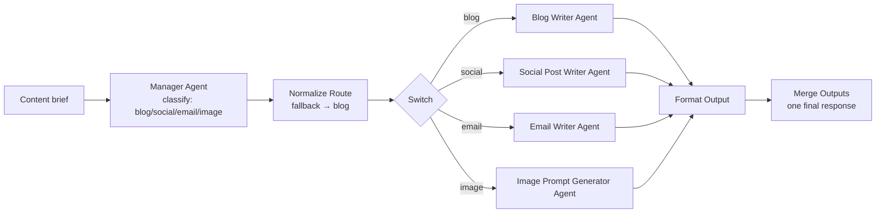
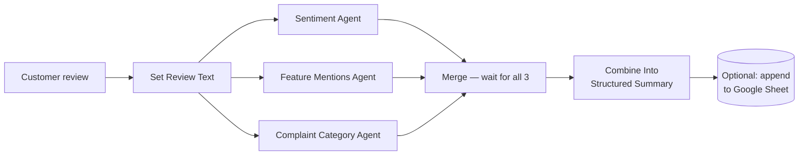

<div align="center">

# 🧭 Router & Parallel Agentic Workflows — n8n

### Two multi-agent patterns solving opposite problems: dispatching to exactly one specialist vs. running several analyses at once


**[⬇️ Content Dispatcher Workflow](assets/content-request-dispatcher.json) · [⬇️ Review Analyzer Workflow](assets/product-review-analyzer.json)**

</div>

---

## TL;DR

Two more multi-agent patterns from the same workshop series as my [Serial workflows](https://github.com/Rehansheikh787) — but these solve the opposite kind of problem. The **Content Request Dispatcher** reads one content brief and routes it to exactly **one** of four specialist writer agents (blog, social, email, or image prompt) — only one path ever fires. The **Product Review Analyzer** takes one customer review and runs **three** independent agents on it *simultaneously* — sentiment, feature mentions, complaint classification — then merges all three results into one structured record. Router picks one path; Parallel runs every path at once. Knowing which situation calls for which is the actual design skill.

**My role:** hands-on builder — designed the classification/routing logic, the three parallel analysis prompts, the merge/parsing logic, and tested both workflows end to end with real briefs and reviews.

---

## 📖 Table of Contents

- [Router vs. Parallel — Why the Distinction Matters](#-router-vs-parallel--why-the-distinction-matters)
- [Build 1 — Content Request Dispatcher (Router)](#-build-1--content-request-dispatcher-router)
- [Build 2 — Product Review Analyzer (Parallel)](#-build-2--product-review-analyzer-parallel)
- [Design Decisions That Mattered](#-design-decisions-that-mattered)
- [What This Demonstrates](#-what-this-demonstrates)

---

## 🔍 Router vs. Parallel — Why the Distinction Matters

These look similar on the surface — both fan out to multiple specialist agents — but they solve genuinely different problems:

| | Router (Build 1) | Parallel (Build 2) |
|---|---|---|
| **How many agents run per request?** | Exactly 1, chosen by a classifier | All of them, every time |
| **Are the outputs related?** | No — only one output is ever produced | Yes — all outputs describe the same input from different angles |
| **Best for** | "This request is *one of* several types" | "I need several *independent* answers about the same thing, and don't want to wait for them one-by-one" |
| **Failure mode to design for** | Classifier picks the wrong / no route | One branch is slow or fails while others succeed |

Picking the wrong pattern for the problem is a real design mistake — running 4 agents in parallel when only one output is ever needed wastes cost and latency for nothing; forcing a single classifier to pick "the one true category" for a review that's genuinely about sentiment *and* features *and* a complaint would lose information a Parallel analysis captures naturally.

---

## 📨 Build 1 — Content Request Dispatcher (Router)

Paste a content brief in chat — "write a blog post about our new savings feature" — and a Manager agent classifies it into exactly one of four content types, then routes to that one specialist.



**Real prompt — Manager Agent**, deliberately constrained to a single-word output so routing logic downstream never has to parse prose:

```text
You are the MANAGER agent in a content team.

Decide which ONE specialist should handle this brief, based on the
format the brief is asking for:
- "blog" - blog post, article, or long-form written piece
- "social" - social media post, tweet, LinkedIn post, or caption
- "email" - email, newsletter, or email campaign copy
- "image" - visual, image, banner, illustration, or graphic

If the brief is ambiguous or asks for multiple things, pick the
PRIMARY deliverable type.

Respond with ONLY one word, exactly one of: blog, social, email, image
No punctuation, no explanation, no extra text.
```

Each of the four specialists has its own distinct prompt tuned to its format — the Blog Writer asks for 3-5 subheadings and 250-400 words; the Social Writer asks for *two* versions (LinkedIn *and* Twitter/X, different length constraints for each); the Email Writer asks for subject line + preview text + body under 200 words; the Image Prompt Generator asks for subject, composition, color palette, and mood in 2-4 sentences. One Manager, four genuinely different writing jobs.

**See it in action** — a real brief classified and routed to a specialist end to end:

<p align="center">

</p>

<p align="center"><sub><a href="assets/dispatcher-demo-full.mp4">▶️ Full-length version (dispatcher-demo-full.mp4)</a></sub></p>

---

## ⭐ Build 2 — Product Review Analyzer (Parallel)

Paste any customer review, and three independent agents analyze it **at the same time** — sentiment, feature mentions, and complaint classification — instead of running one after another. A Merge node waits for all three, then a code node combines them into one clean structured record.



All three agents run at `temperature 0` and are locked to an exact response template — not because creativity is undesirable, but because a downstream regex parser needs a predictable format to extract from:

```text
Sentiment Agent:
Sentiment: <Positive / Negative / Mixed>
Sentiment Score: <-1.0 to 1.0>
Reasoning: <one short sentence>

Feature Mentions Agent:
Features Mentioned: <comma-separated list, or "None">
Primary Feature: <the single most central feature, or "None">

Complaint Category Agent:
Has Complaint: <Yes / No>
Complaint Category: <Delivery Delay / Product Quality / Payment Issue /
  Refund-Cancellation / App-Tech Issue / Customer Support / Pricing /
  Safety-Trust / Other / "None">
Severity: <Low / Medium / High, or "None">
```

The output is written as one structured record — `sentiment`, `sentiment_score`, `features_mentioned`, `primary_feature`, `has_complaint`, `complaint_category`, `severity` — ready to append to a spreadsheet for trend analysis across hundreds of reviews, not just a one-off answer.

**See it in action** — a real review analyzed across all three dimensions simultaneously, with the Google Sheet logging visible:

<p align="center">

</p>

<p align="center"><sub><a href="assets/review-analyzer-demo-full.mp4">▶️ Full-length version (review-analyzer-demo-full.mp4)</a></sub></p>

---

## 🎯 Design Decisions That Mattered

- **Locking the classifier to one word, not a sentence** — the Manager Agent's system message explicitly forbids any output except `blog`, `social`, `email`, or `image`. That single constraint is what lets the `Normalize Route` code node route deterministically instead of fuzzy-matching prose.
- **A default route, not a dead end** — if the Manager's output doesn't cleanly match any of the four expected words, `Normalize Route` falls back to `blog` rather than the workflow silently failing. A wrong-but-reasonable guess beats no output at all for an unattended pipeline.
- **Independent analyses genuinely benefit from running in parallel** — sentiment, feature extraction, and complaint classification don't depend on each other's output, so there's no reason to force them into a slower sequential chain. This is the specific condition that makes Parallel the right pattern instead of Serial.
- **All three parallel agents share the same output discipline** — exact template, `temperature 0`, one regex-parseable field per line. Consistency across independent agents is what makes the `Merge` + `Combine Into Structured Summary` step reliable instead of needing bespoke parsing logic per agent.
- **The Sheets logging step is there but optional** — both this workflow's "Append to Google Sheet" node ships disabled by default. The workflow produces a complete, usable output with or without it, so persistence is an opt-in decision, not a hard dependency.

---

## 🎓 What This Demonstrates

- **Matching the architecture to the actual shape of the problem** — recognizing "exactly one of several outcomes" (Router) versus "several independent facts about the same input" (Parallel) as genuinely different design problems, not defaulting to one pattern out of habit
- **Constraining model output to make downstream logic simple** — a one-word classifier and a locked line-by-line template both exist so plain code (a `.find()`, a regex) can do the parsing, instead of needing another AI call just to interpret the first one
- **Designing the unhappy path in a router** — a default fallback route means a routing failure degrades to "probably not quite right" instead of "nothing happens"
- **Thinking about the analysis at scale, not just per-request** — the review analyzer's structured, spreadsheet-ready output is designed with "run this on hundreds of reviews and look for patterns" in mind, not just answering one review at a time

---

<div align="center">

I'm a **Chemical Engineer transitioning into AI Product Management**, and I build hands-on with agentic workflow tools to understand the real design tradeoffs behind multi-step AI systems.

📂 More case studies and projects on my [GitHub profile](https://github.com/Rehansheikh787).

</div>
